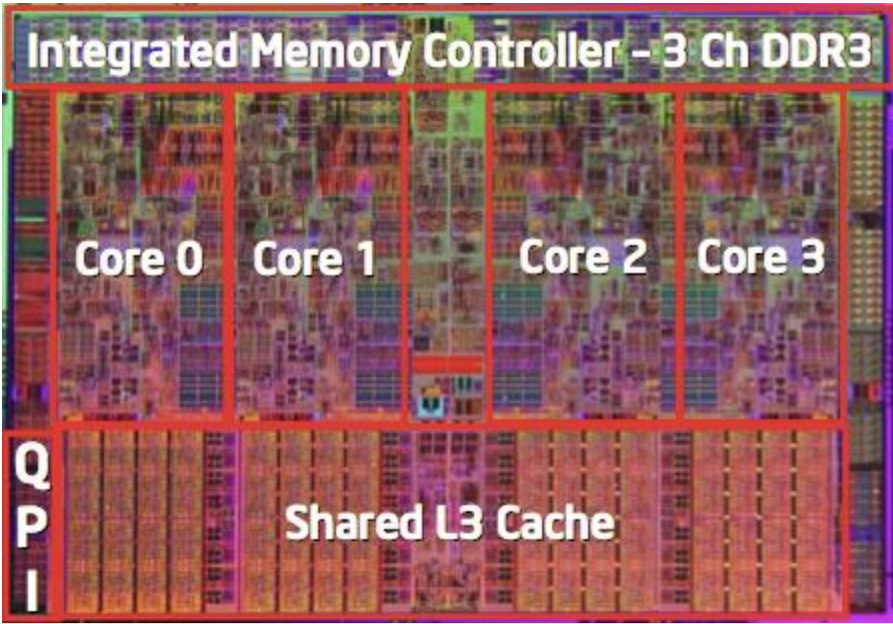

# Machine Level Representation of Programs.

## The History of `x86` Architectures.

Among the most common processor architectures found on computers are the `x86` processors. Dominating the desktop, laptop and server environment; they are also amongst the oldest architectures. being introduced in 1978. The `x86` processor was designed to be backwards compatible up until the `8086` processor models. Most notably, the most recent Chromebook computers and Macbooks switched from `x86` processors to `ARM`.

That one architecture is **backwards compatible** means that any modern machine with this model of processor can run binaries compiled on older processor architectures. The converse is not true however, old computers would not be able to execute binaries compiled on modern `x86` machines. For example, if we compile a binary for `32` bit machines, and we want to run it on a modern machine, backwards compatibility would allow a flag to be set specifying we wish to run a `32` bit binary; however, a binary `64` bit binary compiled on a modern machine cannot be run on a `32` bit machine.

The `x86` line of processors typically come in two flavors. There is `x86_64` which uses `64` bit addressing in memory, and `x86_32` which uses `32` bit addressing. The majority of this course focuses on `x86_64`.

The `x86` line are also among the first processors to use a complex instruction set. The can execute many different instructions with many different formats \(although only a small subset of these formats are encountered with Linux programs\). These kinds of computers are called **complex instruction set computers** \(CISC\). Some of the design choices to achieve this were poor however; the name of registers were poorly though out, and the assembly language is complex. As they added new features to this architecture, they added new assembly instructions. This led to a complex design for the processor. This isn't necessarily efficient, and makes it hard to match the performance of **reduced instruction set computers** \(RISC\); however, Intel has done just that, increasing speed, albeit at the cost of power. These provide tradeoffs in efficiancy and performance and shows how complicated designing architectures is. As of now,

## Milestones for the `x86` processor.

The following table shows the evolutions of `x86` processors related to Moore's law. **Moore's law** states that the number of transistors one can put in a processor doubles every `2` years \(or `1.5`\). This turned out to be a rather optimistic prediction. Moore's law seems to grow exponentially, however due to limitations in resources, the growth is actually logistic, and will eventually taper off.

| **Name** | **Date** | **Transistors** | **MHz** |
| :--- | :---: | :---: | ---: |
| 8086 | 1978 | 29k | 5-10 |
| 386 | 1985 | 275k | 12-33 |
| Pentium 4E | 2004 | 125m | 2800-3800 |
| Core 2 | 2006 | 291m | 1060-3500 |
| Core i7 | 2008 | 731m | 1700-3900 |

We also include a list of notable facts about each processor.

* `8086`
  * First `16` bit processor, basis for `IBM` PC and `DOS`.
  * `1MB` of address space.
* `386`
  * First `32` bit `intel` processor, also referred to as `IA32`.
  * Added **flat addressing** and was capable of running unix.
* `Pentium 4E`
  * First `64` bit intel processor, also referred to as `x86_64`.
  * The Netburst architecture used for these chips was the bases for the dual

    core `Xeon 2.8` processors is `Ada`.
* `Core 2`
  * Amongst the first **multi-core** intel processors.
* `Core i7`
  * The first processor to use `4` cores.

One may notice that as the number of transistors goes up the higher the frequency \(`MHz`\) is needed on the chip. Typically the more transistors one has on a chip the more computations one can do on a machine. The typical way to achieve that was to increase the frequency of the processor. Now, most machines use chips that run in the gigahertz \(`Ghz`\). It is also difficult to add more transistors on a chip without increasing the frequency. This can be a problem, since increasing CPU frequency increases the operating temperature of the processor, which can lead to meltdown; some of the first CPUs got so hot that they could be used to fry an egg. One solution that eases the problem is to "split" the processor into multiple chips called **cores** which can work independently of each other.

Notice that the `Core 2` and `i7` processors decreased in frequency. This is due to being multicore processors. Now we can find processors with up to `8` cores. There is also the question of how processors are **etched**, that is how they are made. Smaller processors can typically support higher frequencies without overheating. This has allowed us to make multicore processors that reach higher frequencies.

Additional features also include instructions that support multimedia operations, instructions to enable more efficient conditional operations, transitions from `32` bit to `64` bit, and of course, more cores.

Going more in depth, if we look at a 2015 `Core i7` processor, we can differentiate different specs for a desktop model and a server model.

* Desktop Model
  * `4` cores.
  * Integrated graphics.
  * `3.3-3.8 GHz`.
  * `65W`.
* Server Model
  * `8` cores.
  * Integrated `I/O`.
  * `2-2.6 GHz`.
  * `45W`.

Processors also get increased advantage from being made smaller and smaller. Usually, the smaller the processor, the cooler it can run, and the more energy efficient it will be. However, smaller processors are more costly to produce. Luckily, thanks to Moore's law, transistors have been getting smaller and smaller, getting into the 10ths of nanometers. [IBM has produced the world's first `2nm` chip](https://arstechnica.com/gadgets/2021/05/ibm-creates-the-worlds-first-2-nm-chip/). However, Moore's law being logistic in growth, limits the size of transistors to `0.2nm`s, that is the size of a silicon atom.

## `x86` Clones: Advanced Micro Devices \(AMD\) and Intel.

Advanced Micro Devices, better known as AMD is a leading competitor to Intel in terms of processors. Historically, the have always followed just behind Intel, producing slower but more affordable processors. They would then go on to recruit the top circuit designers form Digital Equipment Corp. and other companies. They would then go on to build the `Opteron` processor, which became a competitor for the `Pentium 4`. The also developed their own extension to `64` bit architecture called `x86-64`.

The innovation in `64` bit architectures rocketed AMD as a serious competitor to Intel. In recent years though, Intel has gotten its act together and is as of now leading the world in semiconductor technology. AMD on the other hand, has fallen behind; relying on external semiconductor manufacturers.

Focusing now on Intel, in 2001 Intel attenmpted a radical shift from the `IA32` convention for architecture to `IA64`, it was a completely different architecture and considered `IA32` **legacy**, that is something no longer supported. The performance was lackluster. In 2003, AMD stepped in with the `x86-64` architecture, this made Intel focus more on the `IA32` architecture, and avoid admitting mistakes. In 2004, Intel announced the `EM64T` extension for their `IA32` architecture. This extension added `64` bit support and memory, and was a serious competitor to the `x86-64` of AMD.

Since AMD and Intel processors both use the `x86` platform, they can be considered the same. If one were to look at these processors at a deeper level than just the architecture, say, at the electronics, then they would have to be considered separate.

