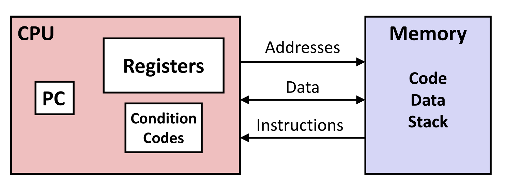
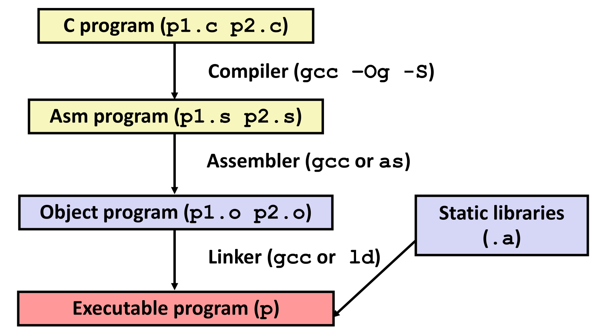

# C, Assembly Language, and Machine Code.

## Definitions.

We talked about architectures in the previous page but what is an architecture. it would help to define some things. We define the **architecture** of a processor to be parts of the processor design that one needs to understand and write assembly and machine code. The **microarchitecture** is the implementation of the architecture of the processor; examples of microarchitecture include cache sizes and core frequencies. We also call the high level design of these architectures**instruction set architectures**, and are used by Intel on `intel` processors. Mobile phones usually use `ARM` architectures. It is useful to note that while different processors can use the same instruction set architecture, they do not implement the same microarchitectures. We will focus just on the architecture in this course.

We have mentioned machine code and assembly previously, but it would serve as a refresher to define them here as well. **Machine code** is the byte level program that a typical architecture executes. This code is highly machine specific and will usually only run on one type of architecture; causing portability issues. **Assembly code** is the text representation of machine code. Assembly being a `1-1` translation of machine code to something more human readable inherits the machine specific nature, and portability issues of machine code; albeit, to a lesser extent.

## Assembly/Machine Code View of a Processor.



Since we do not have to worry about the processor at the mircoarchitecture level, we can view the processor the way typical machine or assembly code would.

The processor in essence consists of two components. The first is the _central processor unit_ \(CPU\), and is the main body from which instructions will be executed. It consists of a **program counter** \(PC\) which stores the address of the next instruction, and is viewed by assembly as the `rip` \(`x86_64`\) or `eip` \(`x86**32`\), and is referred to as the **instruction pointer**. The CPU also contains a **register file** which contains heavily used program data, and contains **condition codes**, which store the status information about arithmetic and logical operations, and is also used for conditional branching \(`if`, `else` statements\). The CPU also contains the **arithmetic logic unit** \(ALU\) which is in charge of handling arithmetic and logical operations.

The other component of a processor is the **memory**. Here, bytes are stored in **addresses** as an addressable array. This array stores code and user data, a **heap** for allocating memory, and a **stack** to support procedures and variables.Typically, the CPU sends address and data to memory, while it fetches data and instructions from memory.

## Turning `C` into Object Code and Compiling into Assembly.

Typically, a programmer wants to turn code written in a high level language, such as `C` into low level machine instructions. For programming languages like `C/C++`, `Java`. This is done through the use of a **compiler**. A programmer can put code into **source** files like `p1.c` and `p2.c` and compile them with the `gcc` compiler though the command:

```bash
~/ccom4086/ > gcc -o p p1.c p2.c
```

Here, the `-o` flag just specifies the output file, the default output is `a.out`. The compiler then takes `p1.c` and `p2.c` as input files and outputs a **binary** file `p` which can be executed by the machine. How the compiler achieves this is by:

1. Converting the source files into assembly.
2. Creating **object** files `p1.o` and `p2.o`.
3. Linking the object files through the linker into the binary file `p`.

If we wanted to implement basic optimization, and even compile it for debugging, we can run `gcc` with the following flags `-Og` \(optimization\) and `-g` \(debugging\):

```bash
~/ccom4086/ > gcc -Og -g -o p p1.c p2.c
```



```c
// sum.c
long plus(long x, long y);

void sumstore(long x, long y, long *dest){

    long t = plus(x,y);
    *dest = t;

    return;
}
```

We can also view the assembly of some code by compiling with the `gcc` flag `-S`, which outputs a `.s` file.

```c
// Portion of sum.s compiled with gcc -Og -S sum.c
sumstore:
.LFB0:
    .cfi_startproc
    pushq    %rbx
    .cfi_def_cfa_offset 16
    .cfi_offset 3, -16
    movq    %rdx, %rbx
    call    plus@PLT
    movq    %rax, (%rbx)
    popq    %rbx
    .cfi_def_cfa_offset 8
    ret
    .cfi_endproc
.LFE0:
    .size    sumstore, .-sumstore
    .ident    "GCC: (GNU) 11.1.0"
    .section    .note.GNU-stack,"",@progbits
```

Due to different versions of the `gcc` compiler running on different machines, the assembly output of the source code varies. So it is possible to have multiple assembly translations of the same source code. Different compiler settings will also affect the assembly output of a program. For example, compare the following assembly compiled without the `-Og` flag to the one above that was.

```c
// Portion of sum.s compiled with gcc -S sum.c
sumstore:
.LFB0:
    .cfi_startproc
    pushq    %rbp
    .cfi_def_cfa_offset 16
    .cfi_offset 6, -16
    movq    %rsp, %rbp
    .cfi_def_cfa_register 6
    subq    $48, %rsp
    movq    %rdi, -24(%rbp)
    movq    %rsi, -32(%rbp)
    movq    %rdx, -40(%rbp)
    movq    -32(%rbp), %rdx
    movq    -24(%rbp), %rax
    movq    %rdx, %rsi
    movq    %rax, %rdi
    call    plus@PLT
    movq    %rax, -8(%rbp)
    movq    -40(%rbp), %rax
    movq    -8(%rbp), %rdx
    movq    %rdx, (%rax)
    nop
    leave
    .cfi_def_cfa 7, 8
    ret
    .cfi_endproc
```

Actually, additional code for exception handling is injected if not using the flag `-fno-asynchronous-unwind-tables`. We usually want to optimize the code, so `-Og` is useful, however the more we optimize the code, the further away the assembly language is from the original source code. Hence it is good practice to apply a level of optimization that maintains some semblance of the original `C` code, in order to maintain readability.

## Assembly Characteristics.

### Data Types.

We list how assembly language treats data types.

* `int`:
  * Are of `1`, `2`, `4`, or `8` bytes.
  * Data values.
  * Addresses \(untyped pointers\).
* Floating point:
  * of `4`, `8`, or `10` bytes.
* Code:
  * Byte sequences encoding a series of instructions.
* No Aggregate types such as arrays or structures.
  * Everything is contiguously allocated in memory.

The `C` language, albeit being high level, was also designed with the purpose of being as low level as possible, and as close to assembly as possible. Because of this, `C` has the added benefit of having some of its data types coincide with those used by assembly. `C++`, being built on top of `C` also benefits from this, however it is noticeably higher level than `C`.

One can perform arithmetic on registers or memory data in assembly language. Typically, data is transferred between memory and a register. Data is loaded from memory into a register, and register data can be stored into memory. Assembly also handles **transfer control** where it executes unconditional jumps to and from procedures, as well as perform conditional branching.

When compiled, the source is translated into assembly, and then loaded into an **assembler**, which translates the `.s` into a `.o` object files, takes a binary encoding of each instruction, and makes an nearly complete image of executable code which is missing the linkage of codes in different files. The **linker** resolves the issue of missing code by resolving references between files and combining the code with _static_ runtime libraries. Some of the code can be **dynamically** linked, which means that linking occurs during program execution. The following is an example of what is typically stored in a `.o` file. When one uses procedures like `printf()` in `C` code, these are located in external libraries \(in this case, `stdio.h`\) and are linked to the program at compilations. If they are not linked, the program would no work.

```bash
~/ccom4086/ > gcc -Og -c sum.c
~/ccom4086/ > objdump -d sum.o
sum.o:     file format elf64-x86-64


Disassembly of section .text:

0000000000000000 <sumstore>:
   0:    53                       push   %rbx
   1:    48 89 d3                 mov    %rdx,%rbx
   4:    e8 00 00 00 00           call   9 <sumstore+0x9>
   9:    48 89 03                 mov    %rax,(%rbx)
   c:    5b                       pop    %rbx
   d:    c3                       ret
```

Using the command `objdump` is useful for examining object code. With it one can analyze but patterns of series of instructions, and produces an approximate rendition of assembly code. It can also be run on `a.out` files \(that is complete binaries\) as well as `.o` object files. Typically an object dump of a binary file has the following format: The following is a portion of an object dump performed on the `cat` command of `unix` \(`/usr/bin/cat`\):

```bash
~/ccom4086/ > objdump -d /usr/bin/cat | head

/usr/bin/cat:     file format elf64-x86-64


Disassembly of section .init:

0000000000002000 <.init>:
    2000:    f3 0f 1e fa              endbr64
    2004:    48 83 ec 08              sub    $0x8,%rsp
    2008:    48 8b 05 19 8f 00 00     mov    0x8f19(%rip),%rax
```

```text
    addr:   machine code isntr        assembly code instr.
```

The `addr` portion is where the address of the machine code. The machine code instructions then come after; here the first byte of the machine code piece is stored in the address. After comes the assembly counter part of the machine code.

Any piece of software on a computer can be interpreted as executable code, and hence they can be dissassembled via an object dump. The dissassemble examines the bytes and reconstructs the assembly source. It is worth noting that while one may able to disassemble every peice of software, legal agreements and proprietary licences prohibit it. For example, disassembling a piece of a Windows `.exe` binary for reverse engineering is forbidden under the Microsoft End User License Agreement.

