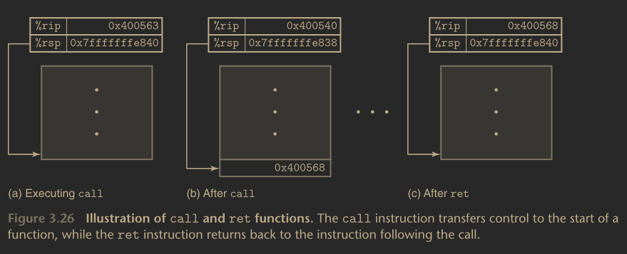

## Procedures.

Porcedures provide a way to package code that implement functionality with
designated arguments and a return value. They can be called from different
points in the program. Well designed software use procedures as an abstraction
mechanism, that hide the details of implementation of the task, while providing
a clear and consise interface definition of what will be computed, and how the
procedure affects the program.

There are many different attributes that have to be handled when providing
support for preocedures at the machine level. Suppose, that a procedure `P`
calls a procedure `Q`; `Q` then executes, and returns back to `P`. These actions
involve the follwing mechanisms:

- Passing control
    - The program counter is set to the starting address of the code `Q` upon
      entry, and set then set to the address of `P` upon returning.

- Passing data
    - `P` must be able to provide one or more parameters to `Q`, and `Q` must be
      able to return a value back to `P`.

- Allocation of memory
    - `Q` may need to allocate space for local variables when it begins, and
      likewise free the memory used upon returning.

The `x86_64` implementations of procedures involve the combination of
instructions and conventions on how to set up machine resources using the stack.
Great effort is made to minimize the overhead when invoking the procedure. It
then follows what can be seen as a minimalist stratagy, implementing only
what is needed for the particular procedure.

We have already seen the stack, and how it relates to procedures, hence we will
not go over it here; instead one should refer to the relevent sections. We begin
the analysis with control transferring. One thing to cover on stacks, is that
the `x86_64` pocedureas allocate only what they need on the stack frame; this
is done in the interest of space and time efficiency. In fact, some
functions do not even need stack frames. These are what we call **leaf
procedures**, as a reference to the tree structure of the function calls. Leaf
procedures occur when all of the local variables can be held in registers,
provided the function does not make a call to another function.

### Control Transfer.

To transfer control from one function `P` to another function `Q`, all that is
needed is to set `rip` to the starting address of `Q`. The caveat, is the the
function `Q` must resume the execution of the program after it has finished. In
particular, this information is recorded in `x86_64` by invoking `Q` with the
`call` instruction. This pushes an address `A` onto the stack, and then sets
`rip` to the address of `Q`. We call `A` the **return address**, and is
computed as the next instruction after `call Q`. The instruction `ret` pops the
address `A` off of the stack, and then sets `rip` to `A`. We can view the
general form of a the call and return instructions for procedures as:

```c
Instruction         Description
--------------------------------------
call    Label    |  Call a procedure.
call    *Operand |  Call a procedutre.
ret              |  Call a procedure.
```

The targer of the `call` instruction is the address of where the procedure
starts. They can either be direct, or indirect. The target of a direct `call`
is given a label where as the target of an indirect call is given by a pointer
reference to the location in memory (an address operand specifier preappended by
`*`).

The followingn figure illustrates the execution of the `call` and `ret`
instructions for the following block of assembly code:

```c
    push    %rbx
    mov     %rdx,               %rbx
    ...
    retq
    ...
    callq   400540 <multstore>
    mov     0x8(%rsp),          %rdx
```




If we consider the following piece of assembly code:
```c
400540 <leaf>:
    lea     0x3(%rdi),      %rax        // L1: z+2
    retq                                // L2: return.
400545 <top>:
    sub     $0x5,           %rdi        // T1: x-5
    callq   400540 <leaf>               // T2: call leaf
    add     %rax,           %rax        // T3: Double the result.
    retq                                // T4: Return.
...
400550 <main>:
    callq   400545 <top>                // M1: call top.
    mov     %rax,           %rdx        // M2: resume execution.
```

In where we are given a `main` function, and two functions called `top` and
`leaf`. Identifying the labels as `T1-T4`, `L1,L2` and `M1, M2` for `top`,
`leaf` and `main`, respectively, we can trace the execution of the program by
following the calls to the procedures `top` and `leaf`. Here we call `top(100)`
and `leaf(95)`. `leaf(95)` returns `97` to `top`, which in turn returns `194`
to `main`. We give the trace of the entire block in the following table. The
first three columns show the execution flow, and the next for columns show the
state of the program *before* each instruction is executed.

|Label  |       PC      |   Instruction |   `%rdi`  |   `%rax`  |   %`rsp`      |   `*%rsp` |   Description|
|:---   |:---:          |   :---:       |   :---:   |   :---:   |   :---:       |   :---:   |          ---:|
|M1     |`0x40055b`     |   `callq`     |   `100`   |           |   `0xe820`    |           |call top(100).|
|T1     |`0x400545`     |   `sub`       |   `100`   |           |   `0xe818`    |`0x400560` |enter top.    |
|T2     |`0x400549`     |   `callq`     |   `95`    |           |   `0xe818`    |`0x400560` |call leaf(95).|
|       |               |               |           |           |               |           |              |
|L1     |`0x400540`     |   `lea`       |   `95`    |           |   `0xe810`    |`0x40054e` |enter leaf.   |
|L2     |`0x400544`     |   `retq`      |           |   `97`    |   `0xe810`    |`0x40054e` |return `97`   |
|       |               |               |           |           |               |           |              |
|T3     |`0x40054e`     |   `add`       |           |   `97`    |   `0xe818`    |`0x400560` |resume top.   |
|T4     |`0x400551`     |   `retq`      |           |   `194`   |   `0xe818`    |`0x400560` |return `194`. |
|       |               |               |           |           |               |           |              |
|M2     |`0x400560`     |   `mov`       |           |   `194`   |   `0xe820`    |           |resume main.  |

This table also shows the importance of the runtime stack in manegingn
procedures. The mechanism of pushing to, and popping values from the stack
perfectly suits the execution flow of calling procedures. Pushing the return
address onto the stack makes it possible for the program to resume execution.


### Data Transfer.

Passing control isn't the only thing one needs to do with procedure. Often,
functions take arguments, so it is also necessary to be able to pass data
values, as well as returning them. Most of the data transfer in `x86_64`
architecure happens via the registers. When a procedure `P` calls a procedure
`Q`, the code for `P` must copy the arguments into the appropriate registers
(`x86_64` convention dictates `rdi`, `rsi`, `rdx`, `r10`, `r8`, and `r9` be
used for the first $6$ arguments). Similarly, when `Q` returns to `P`, the code
for `P` can access the returned value in the `rax` register. Below is the given
table for which registers arguments can be passed to for `x86_64`, `i389`,
`sparc`, and `arm` architectures (among various others):

|Architecture   |`arg1`|`arg2`|`arg3`|`arg4`|`arg5`|`arg6`|
|:---           |:---: |:---: |:---: |:---: |:---: |  ---:|
|`arm/OABI`     |`r0`  |`r1`  |`r2`  |`r3`  |`r4`  |`x5`  |
|`arm/EABI`     |`r0`  |`r1`  |`r2`  |`r3`  |`r4`  |`x5`  |
|`arm64`        |`x0`  |`x1`  |`x2`  |`x3`  |`x4`  |`x5`  |
|`ia386`        |`ebx` |`ecx` |`edx` |`esi` |`edi` |`esp` |
|`sparc/32`     |`o0`  |`o1`  |`o2`  |`o3`  |`o4`  |`o5`  |
|`sparc/64`     |`o0`  |`o1`  |`o2`  |`o3`  |`o4`  |`o5`  |
|`x86_64`       |`rdi` |`rsi` |`rdx` |`r10` |`r9`  |`r8`  |

One should consult `man 2 syscall` for more information on which registers
which arguments are passed, and the corresponding architectures.

It is apparent that with `x86_64`, up to six arguments can be passed via
registers, and the registers are used in a specific order. The name of the
register depends on the size of the data value that it has been passed. For
example, a `long` as a first argument will be stored in `rdi`, where as an
`int` passed as a first argument can be stored in `edi`.

Functions with more than six arguments (some architectures allow for up to `7`,
but `x86_64` does not) have their extra arguments passed onto the stack. If the
procedure `P` calls the procedure `Q` with $n>6$ `int` arguments, the first $6$
are passed into the registers, while memory is allocated on the stack for the
remaining $n-6$ arguments. It is also important to note that when passing
parameters on the stack, all the data sizes are rounded up by multiples of $8$.
After the arguments are in place, the program can execute the `call` and `ret`
instructions approptiately, The pocedure `Q` can access all the arguments
through the registers, and possibly through the stack.

```c
void proc(long a1,long *a1p,long a2,long *a2p,long a3,long *a3p,long a4,long *a4p){
    *a1p += a1;
    *a2p += a2;
    *a3p += a3;
    *a4p += a1;
}
```

In the above program, a procedure called `proc` takes `8` arguments,`a1`, `a2`,
`a3`, `a4`, along with their respective pointers, `a1p`, a2p`, `a3p`, and
`a4p`. In the disassembly below, we see that the first six arguments, `a1`,
`a1p`, `a2`, `a2p`l `a3`, and `a3p` are passed into the repsective registers
according to `x86_64` calling convention. The remaining two arguments, `a4` and
`a4p` are then allocated on the stac, and then fetched with `mov` instructions
of their arguments into the register `rax`.

```c
proc:
    movq    16(%rsp),   %rax        // fetch a4p.
    addq    %rdi,       (%rsi)      // *a1p += a1.
    addl    %edx,       (%rcx)      // *a2p += a2.
    addw    %r8w,       (%r9)       // *a3p += a3.
    movl    8(%rsp),    %edx        // fetch a4.
    addb    %dl,        (%rax)      // *a4p += a4`
    ret
```

#### Local Storage on The Stack.

In some cases, not all of the storage required by a procedure can be stored in
registers. Even when a procedure has more than $6$ arguments, the arguments
stored on the stack can be moved into the `rax` register. Som cases where this
does not apply is:

- When there are not enough registers to hold all the local data.
- The address operator `&` is applied to a local variable, and hence must
  necessitate an address.
- Some of the local variables are structures that must be accessed using the
  appropriate structure references.

```c
long swap_add(long *xp, long *yp){
    long x = *xp;
    long y = *yp;

    *xp = y;
    *yp = x;

    return x+y;
}
```
```c
long caller(){
    long arg1 = 534;
    long arg2 = 1057;

    long sum = swap_add(&arg1, &arg2);
    long diff = arg1-arg2;

    return sum*diff;
}
```

In the above code examples, we have a calling function that returns the sum and
the difference of two `long`s and returns their product. The sum is stored as
the return value of the `swap_add` procedure which takes two `long` integers and
swaps them. Here `caller` calls `swap_add` with two arguments by reference,
which means that local storage must be applied. The disassmebly below
illustrates how this happens.

```c
caller:
    subq    $16,        %rsp    // set up the stack frame.

    movq    $534,       (%rsp)  // move arg1 into rsp.
    movq    $1057,      8(%rsp) // move arg2 into rsp+8.

    leaq    8(%rsp),    %rsi    // store &arg2 in rsi as the second argument.
    movq    %rsp,       %rdi    // store &arg1 in rdi as the first argument.

    call    swap_add            // call swap_add.
    movq    (%rsp),     %rdx    // store arg1 in rsp.
    subq    8(%rsp),    %rdx    // subtract rsp+2 (arg2) from rdx (arg1).
    imulq   %rdx,       %rax    // compute sum*diff.

    addq    $16,        %rsp    // restore the stack frame.
    ret                         // return.
```

The first argument is stored at the top of the stack, and the second is stored
`8` bytes down in accordance to memory allocation on the stack. They are then
used appropriately to get the sum and then return `sum*diff`. This makes
allocating local storage for a program straight forward, by using the stack,
which is already used to handle procedures. It would be a useful exercise to
examine the following code along with its disassembly and determine what is
being stored locally and what isn't

```c
long call_proc(){
    long x1 = 1;
    int x2 = 2;
    short x3 = 3;
    char x4 = 4;

    proc(x1, &x1, x2, &x2, x3, &x3, x4, &x4);

    return (x1+x2)*(x3-x4);
}
------------------------------------------------------------------
call_proc:
	subq	$40,        %rsp
	movq	%rax,       24(%rsp)
	xorl	%eax,       %eax

	movq	$1,         16(%rsp)
	movl	$2,         12(%rsp)
	movw	$3,         10(%rsp)
	movb	$4,         9(%rsp)

	leaq	12(%rsp),   %rcx
	leaq	16(%rsp),   %rsi
	leaq	9(%rsp),    %rax

	pushq	%rax
	pushq	$4

	leaq	26(%rsp),   %r9

	movl	$3,         %r8d
	movl	$2,         %edx
	movl	$1,         %edi

	call	proc

	movslq	28(%rsp),   %rax

	addq	32(%rsp),   %rax
	movswl	26(%rsp),   %edx
	movsbl	25(%rsp),   %ecx
	subl	%ecx,       %edx
	movslq	%edx,       %rdx
	imulq	%rdx,       %rax

	addq	$16,        %rsp
	movq	24(%rsp),   %rdx
	addq	$40, %rsp
	ret
```

#### Local Storage in Registers.

The `x86_64` register adopts a uniform set of conventions for register usage
that must be respected by all procedutes, including the ones in the libraries.
This is because, that although only one procedure can access the registers at
any given time, the register serves as a universal storage mechainism for *all*
the procedures. So it becomes important that when the caller function calls a
callee function, the callee does not overwrite any register in which a value
was stored for later use.

The `rbx`, `rbp`, and the `r12-r15` registers are the **callee saved**
registers. That is when a procedure `P` calls a procedure `Q`, `Q` must
preserve the values sotred in these registers. The procedure `Q` either does
not bother with the register, or it pushes the value of the register onto the
stack, alters the register for whatever instruction it is to execute, and then
restores the original value of the register once it is done with it. Pushing
these values onto the stack creates the **saved register** portion of the
stack.

All the other registers on the stack, with the exception of `rsp` are the
**caller saved** registers. They can be modified by any procedure, and the name
can be understood in the context that the caller must save the data of the
register before it calls the callee, since the callee is free to alter the
register.

Consider the following function `P`, which calls `Q` twice, stores the return
values, and then returns the sum of the values. P has stored `x` in some caller
saved register, and hence must store `x` for later use in the second call to
`Q`. It may do this by storing `x` into a callee saved register. Similarly,
during the second call, it must save the value stored in `u` some place as that
too might get overwritten. We can in the disassembly that the registers `rbx`
and `rbp` are used to preserve the relevant values.

```c
long P(long x, long y){
    long u = Q(y);
    long v = Q(x);

    return u+v;
}
--------------------------------------------------------------------------------
P:
	pushq	%rbp            // save rbp
	pushq	%rbx            // save rbx

	movq	%rdi,   %rbp    // set up the stack frame.
	movq	%rsi,   %rdi    // save x for later use.
	call	Q               // call Q(y).

	movq	%rax,   %rbx    // save u=Q(y) for later use.
	movq	%rbp,   %rdi    // move x to rdi.
	call	Q               // call Q(x).

	addq	%rbx,   %rax    // add u+v.

	popq	%rbx            // restore rbx.
	popq	%rbp            // restore rbp.
	ret
```

### Recursive Procedures.

Since each procedure has its own space on the stack, the local variables for
each procedure do not interfere with eachother. Furthermore, the convention for
allocating and deallocating local storage allows for procedures to call
themselves recursively. Consider the factorial function:

```c
long fact(long n){
    if(n <= 1){
        return 1;
    }

    return n*fact(n-1);
}
--------------------------------------------------------------------------------
fact:
.LFB0:
	cmpq	$1,         %rdi    // compare 1:rdi.
	jle     .L3                 // if <=, jump .L3
	pushq	%rbx                // save the value at rbx.
	movq	%rdi,       %rbx    // mvoe n into rbx.
	leaq	-1(%rdi),   %rdi    // decrement n.
	call	fact
	imulq	%rbx,       %rax    //multipy rbx with the result of fact.
	popq	%rbx                // restore rbx.

.L3:                            // return 1.
	movl	$1,         %eax
	ret
```

Notice that the assembly stores a value at `rbx` for local storage with
registers, and then stores `n` into `rbp`. `rdi` is decremented and the
`fact(n-1)` is called. We then multiply rbx by rax which holds the desired
result. The whole procedure is the repeated recursively with `n-1` in `rdi`. SO
we see that recursive functions are called just like any other functions; the
only exception is that they call themselves. So the conventions made allow for
recursion to procede naturally without any registers or local storage
confilcting. This convention, also allows for even more complex patterns such
as mutual reccurion, in which a procedure `P` calls a procedure `Q`, which
in turn calls `P`.
