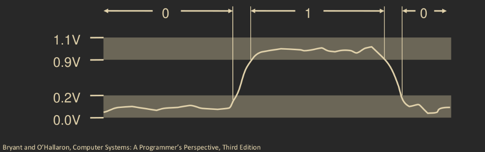

# Numerical Representation in Computers.

## Representation of Information.

### Binary, Decimal and Hexadecimal

In a computer system, numerical information is encoded in _binray digits_, or _bits_. Bits are encoded as 0 or 1; hence, one can view a computer as working over the finite field of two elements GF\(2\) \(addition and multiplication are difined a little differently\). By encoding bits in various ways, computers determine what instructions to execute and represent numbers in different bases, strings of characters, etc, and manipulate them.

Why do computers use bits? Bits are easy to work with. A typical computer operates with transistors turning _on_ with a HIGH voltage, and turring _off_ with a LOW voltage. This makes the values 0 and 1 natural analogs to represent LOW and HIGH, OFF and ON, or FALSE and TRUE. So bits are easy to store with bistable elements. Another reason why bits are preferred, is that they can be reliably transmitted on noisy, or faulty wires, reducing the cost of error correction.

#### Example

* `15213` in decimal is `11101101101101` in binary.
* `1.20` in decimal is `1.0011001100110011[0011]...` in binary.
* `1.55213 x 10^4` in decimal is `1.1101101101101 x 2^13` in binary.

We can encode 8 bits into a _byte_ value. With this encoding, we can represent 256 different numbers. In decimal we can represent the numbers `0` to `255` and in binary `00000000` to `11111111`.

_Hexidecimal_ is also a useful way to encode bytes. Representing one hexadecimal digit, `0-9` and `a-f`, as 4 bits, a byte is represented as any combination of two hex digits. For example, the byte `00001111` can be represented as `0x0f` in hex. Then the hexadecimal number `0xfa1d37b` is `1111101000011101001101111011` in binary and `4196218235` in decimal.

Here we are assuming that the reader knows how to convert decimal to binary to hex and vice versa. It would also be useful to know or learn some algorithms for easy conversion.

### Data Representation

The following table shows some data representations in different architectures, and their sizes.

<table>
  <thead>
    <tr>
      <th style="text-align:left"><code>C</code> Data Type</th>
      <th style="text-align:left"><code>32</code> bit</th>
      <th style="text-align:left"><code>64</code> bit</th>
      <th style="text-align:left"><code>x86_64</code>
      </th>
      <th style="text-align:left">Size</th>
    </tr>
  </thead>
  <tbody>
    <tr>
      <td style="text-align:left"><code>char</code>
      </td>
      <td style="text-align:left"><code>1</code> byte</td>
      <td style="text-align:left"><code>1</code> byte</td>
      <td style="text-align:left"><code>1</code> byte</td>
      <td style="text-align:left"><code>8</code> bits</td>
    </tr>
    <tr>
      <td style="text-align:left"><code>short</code>
      </td>
      <td style="text-align:left"><code>2</code> bytes</td>
      <td style="text-align:left"><code>2</code> bytes</td>
      <td style="text-align:left"><code>2</code> bytes</td>
      <td style="text-align:left"><code>16</code> bits</td>
    </tr>
    <tr>
      <td style="text-align:left"><code>int</code>
      </td>
      <td style="text-align:left"><code>4</code> bytes</td>
      <td style="text-align:left"><code>4</code> bytes</td>
      <td style="text-align:left"> <code>4</code> bytes</td>
      <td style="text-align:left"><code>32</code> bits</td>
    </tr>
    <tr>
      <td style="text-align:left">~ |~<code>long</code>
      </td>
      <td style="text-align:left"><code>4</code> bytes</td>
      <td style="text-align:left"><code>8</code> bytes</td>
      <td style="text-align:left"><code>8</code> bytes</td>
      <td style="text-align:left">
        
<code>32</code> bits

        
or <code>64</code> bitsk

      </td>
    </tr>
    <tr>
      <td style="text-align:left"><code>float</code>
      </td>
      <td style="text-align:left"><code>4</code> bytes</td>
      <td style="text-align:left"><code>4</code> bytes</td>
      <td style="text-align:left"><code>4</code> bytes</td>
      <td style="text-align:left"><code>32</code> bits</td>
    </tr>
    <tr>
      <td style="text-align:left"><code>double</code> 
      </td>
      <td style="text-align:left"><code>8</code> bytes</td>
      <td style="text-align:left"><code>8</code> bytes</td>
      <td style="text-align:left"><code>8</code> bytes</td>
      <td style="text-align:left"><code>64</code> bits</td>
    </tr>
    <tr>
      <td style="text-align:left"><code>long double</code>
      </td>
      <td style="text-align:left"></td>
      <td style="text-align:left"></td>
      <td style="text-align:left"><code>10</code>/<code>16</code> bytes</td>
      <td style="text-align:left"></td>
    </tr>
    <tr>
      <td style="text-align:left">pointer</td>
      <td style="text-align:left"><code>4</code> bytes</td>
      <td style="text-align:left"><code>8</code> bytes</td>
      <td style="text-align:left"><code>8</code> bytes</td>
      <td style="text-align:left">
        
<code>32</code> bit

        
vs <code>64</code> bit addressing

      </td>
    </tr>
  </tbody>
</table>

## Bit Level Manipulation.

| And |  |  |  | Or |  |  |
| :--- | :--- | :--- | :--- | :--- | :--- | :--- |
| `&` | `0` | `1` |  | `|` | `0` | `1` |
| `0` | `0` | `0` |  | `0` | `0` | `1` |
| `1` | `0` | `1` |  | `1` | `1` | `1` |

| Not |  |  |  | Xor |  |  |
| :--- | :--- | :--- | :--- | :--- | :--- | :--- |
| `~` |  |  |  | `^` | `0` | `1` |
| `0` | `1` |  |  | `0` | `0` | `1` |
| `1` | `0` |  |  | `1` | `1` | `0` |

The way we manipulate binary digits is with _Boolean algebra_, developed by George Boole, with defines an algebra  \(not in the mathematical ddefinition\) over the finite field GF\(2\). This algebra is useful for representing the logic of computers, in which `1` is encoded as `true` and `0` is `false`. The following are some bitwise operations of boolean algebra.

* The _and_ operation `&` in where `A&B=1` only when both `A=1` and `B=1` and `A&B=0` in any other case.
* The _or_ operation `|` where `A|B=1` when either `A=1` or `B=1`, and `A|B=0` when both are `0`.
* The _not_ \(or _negation_\) operation `~` where `~A=1` when `A=0` and `A=0` when `A=1`.
* The _exclusive or_ \(_xor_\) operation `^`, where `A^B=1` when either `A=1` or `B=1` \(but not both\), and `A^B=0` in any other case.

These operations are applied bit wise, that is if:

$$
a=(a_{0}, \dots, a_{k}) \text{ and } b=(b_{0}, \dots, b_{k})
$$

Are `k` bit binary numbers, and if $$*$$ is a bitwise operation \(not necesarily those of above, then:

$$
a*b = (a_{0}*b_{0}, \dots, a_{k}*b_{k})
$$

One interesting thing to note, is that GF\(2\) forms an abelian group under `&`, and abelian group over `|`, and that `&` distributes over `|`. So `|` can be viewed as an addition over GF\(2\), and `&` as multiplication \(we also see that `|` distributes over `&`\). That is GF\(2\) forms a field over `&` and `|`. So an computer can be seen as operating over an `n` dimensional vector space over GF\(2\).

Let us put aside first that given the binary number represented as a vector, we make the following convention:

$$
(a_0, \dots a_{k}) \equiv a_k \cdot 2^k+\dots+a_{0} \cdot 2^0
$$

\(That is we represent binary numbers mathematically in little-endian fashion, more on that later\).

### Bit Level Operations in C.

In `C/C++`, bit level operations operate on any integal data types \(`char`, `short`, `int`, `long`, and `unsigned`\). And, as described above, they view their arguments as bit vectors, and are applied bitwise.

#### Example.

* `~0x41 = 0xbe`.
  * `~01000001 = 10111110`.
* `~0x00 = 0xff`.
  * `~00000000 = 11111111`.
* `0x69 & 0x55 = 0x41`.
  * `01101001 & 01010101 = 01000001`.
* `0x69 | 0x55 = 0x7d`.
  * `01101001 | 01010101 = 01111101`.

In contrast to the logical operatiors of `C/C++` \(`&&`, `||`, and `!`\), which view `0` as `false` and any nonzero value as `true`, they will always return `0` or `1`, and terminate as early as possible. For example for `int a = 0`, `a && p/a` will return `0`, moreover it will terminate as soon as it evaluates `a`, and will never evaluate `p/a` which is a division by `0`.

### Shift Operations.

There are additional bit operations called _shift operations_. There is a _left shift_ denoted by `<<` and a _right shift_ denoted by `>>`.

#### Left Shifts

We define the left shift operation as follows. Given a bit vector

$$
x = (x_{0}, \dots, x_{k})
$$

 And an integer `w`, 

$$
x << w = (0, \dots, 0, x_{0}, \dots, x_{k-w-1})
$$

That is the left shift shifts `x` `w` bits to the left and ovewrites the least signififcant bits with `0`.

#### Right Shifts.

There are two different definitions for what a right shift is. There is a _logical_ right shift and an _arithmetic_ right shift.

Given a bit vector `x` and an integer `w`, and the logical right shift `>>`, `x >> w` shifts the bits of `x` `w` bits to the right and overwrites the remaining bits with `0`.

#### Example.

* `0x01 << 4 = 0x04`.
  * `00000001 << 4 = 00010000`.
  * `1 << 4 = 16`.

Given an vecotr `x` and an integer `w`, and the arithmetic right shift `>>`, `x >> w` overwrites the left most `w` bits by the most significant bit of `x`.

#### Example

* `10100010 >> 2 = 00101000` \(logical right shift\).
* `10100010 >> 2 = 11101000` \(arithmetic right shift\).

### Shift implementations in C/C++.

Given a left or a right \(arithmetic or logical\) shift, and a bit vector, it is possible to completely overwrite the bit vector if an integer greater than or equal the bit length is chosen. For example, `001100 << 6 = 000000`. And `1010 >> 4 = 0000` or `1010 >> 4 = 1111` \(depending on the context\). For that reason, in `C/C++` it is good to choose an integer that is less than the size of the given data type when using a either shift operations. In certain cases, it may be that the shift operation actually shifts `k mod w` bits, \(where `w` is a given integer, and `k` is the size of the data type\), hoewever it is not consistent. In some machines, only `log_2(w)` bits of the shift ammount will actually be shifted.

Another behaviour is tha `C` does not precisely define whether a right shift is logical or arithmetic, leading to portability issues.

## 

