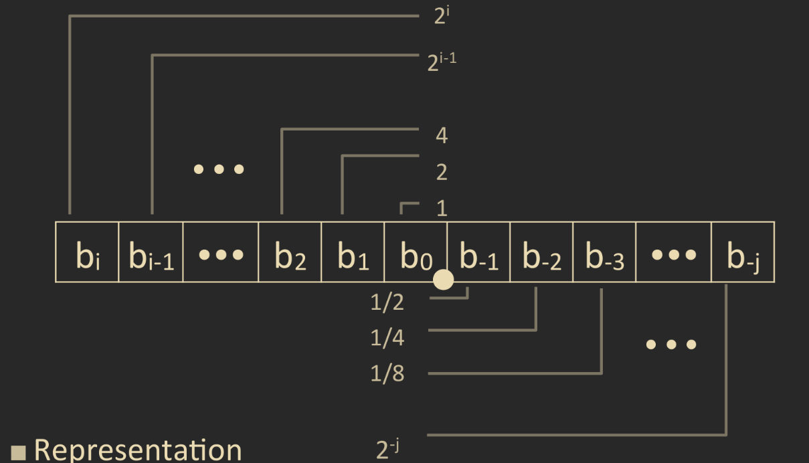
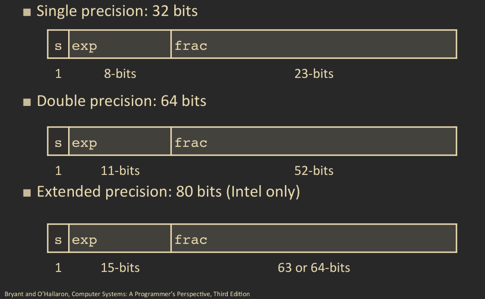
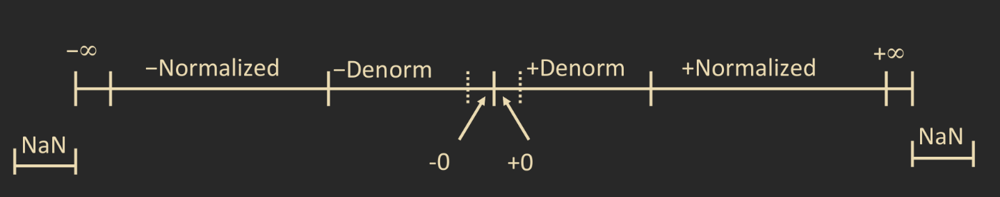
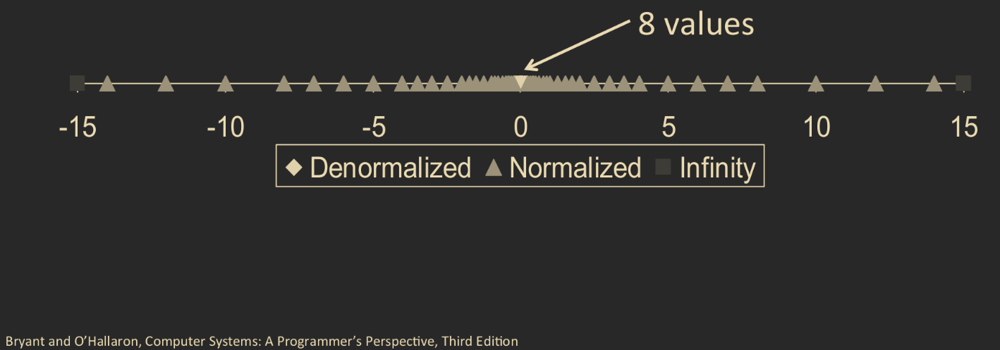
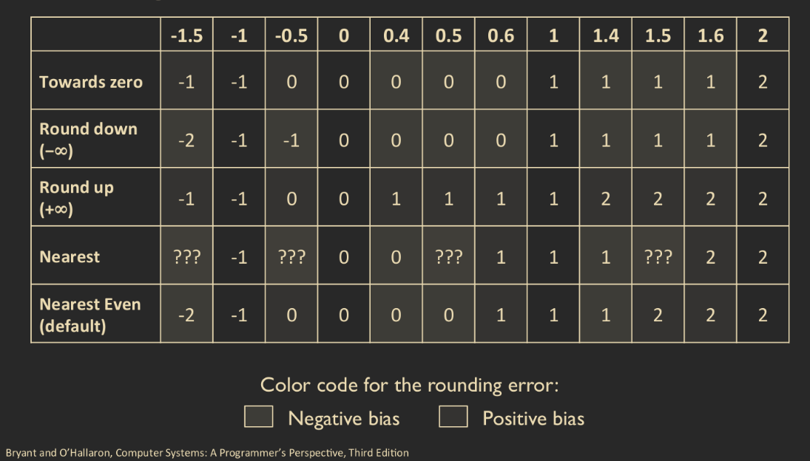

# Floating Point Numbers.

## Fractional Binary Numbers.

Much like how we can express base `10` numbers in decimal notation, we can do the same for binary numbers. A binary number can be expressed as:

$$
\sum_{i=1}^k{b_i \cdot 2^i}
$$

We add a _binary point_ after the digit represented by `2^0`, and fractional powers of `2` are represented afte this point. We we get that the binary number `1011.101` can be represented as:

$$
1011.101_2=2^3+2+1+\frac{1}{2}+\frac{1}{2^3}=\frac{23}{4}_{10}
$$

Much how we divide by `2` to convert base `10` to binary, for numbers after the decimal point, we multiply by `2`. Now a computer cannot compute infnite sums, however, we notice that numbers of the fomr `.1111...1....` are just below `1.0`, which serves as the largest fractional value that a computer can encode.

There are two limitations to this representation however. The first is that it can only represent numbers of the form `x/2^k` where as other rational numbers have repeating bit representations; for example:

* `1/3 = 0.1010101[01]...`
* `1/5 = 0.0011001100110[0011]...`

The other limitation is that just setting the binary point within the `w` bits limits the range of values. How can we represent ver small or very large values?

## The IEEE Floating Point Standard.

In 1985, the Institute of Electrical and Electronics Engineers \(the IEEE\) established a standard for floating point representations of nuumbers in what is now called the [IEEE standard 754](https://www.geeksforgeeks.org/ieee-standard-754-floating-point-numbers/). The most recent version was published in 2019. The age of this standar also means that it has been adopted by all major CPUs.

The IEEE 754 was driven by numerical concerns, and aimed to set nice stndards for rounding floating point numbers, and how to manage underflow and overflow. A drawback is that it is hard to make fast in hardware.

The IEEE defines a floating point number to be of the form:

$$
(-1)^s2^EM
$$

Where `s` is the _sign_ bit, `M` is the _significand_ or _mantissa_, which is between `1.0` and `2.0`; and `E` is the _exponent_. The encoding of a floating point number is as follows:

* `s` is the most significant bit of the number.
* `E` is encoded in the `exp` field.
* The `frac` field encodes `M`.

It is important to note that `exp` and `frac` are not encoded directly. However there is a `1-1` relation between `E`, `M` and `exp` and `frac`, respectively.

Choices have to be made in how many bits we want to encode `exp` and `frac`. The more bits we encode into `exp`, the larger the number we can encode. The more bits we encode into `frac`, the more precise, and smaller the values we can encode. There are three ways we can encode `exp` and `frac`. There is _single precision_ encoding, in where the floating point number is encoded with `32` bits, `1` bit for `s`, `8` bits for `exp`, and `23` bits for `frac`. Alternatively, _double precision_ encodes the floating point in `64` bits, wit `1` bit for `s`, `11` bits for `exp` and `52` bits for `frac`. Finally there is the _extended precision_ encoding, which encodes the floating point number in `80` bits. Again, `1` bit for `s`. In extended precision, `15` bits are used for `exp` and `64` bits for `frac` \(sometimes `63`\). Extended precision is supported only by Intel.

### Normalized Values.

Given the following floating point integer `float f = 15213.0`, we see that `15213 = 11101101101110` is an integer value, but we do not have to store it as an interger. However, this integer does not fit in the established representation for floating point numbers. For this, we can _normalize_ the mantissa to be between `1.0` and `2.0`. In accordance, we would then express this as: `15213 = 1.1101101101110 X 2^13`. This is similar to scientific notation for base `10`.

Now if we want to encode this integer as a floating point we encode `E` as a _biased_ value of the form `E=exp-bias`, where

$$
bias = 2^{k-1}-1
$$

The mantissa is encoded as `1.xxx...x` with an implied leading `1` and where `xxx...x` is encoded into the `frac` field. In this encoding, the mantissa attains maximum when `frac = 000...0` and attains a minimum when `frac = 111...1`. Normalized values are used when `exp =/= 000...0` or `exp =/= 111...1`. Notice for the mantissa, we get the leading bit `1` for free, giving one bit extra for precision.

### Denormalized Values.

We use _denormalized_ values specifically when `exp = 000...0`. In this case, we encode the mantissa as `M = 0.xxx...x`, where `frac = xxx...x`, and we encode `E` as `E = 1-bias`. Cases for denormalized values include when both `exp = 000...0` and `frac = 000...0`, which represents `0`, or when `exp = 000...0` but `frac =/= 000...0`, in which case it is a number close to `0.0`.

### Special Values.

Special values for floating point numbers include the following cases:

* `exp = 111...1` and `frac = 000...0`. Here this represents the value infinity. This case can happen when operations overflow, or when a division by `0` is performed. It inlcudes both positive and negative infinity.
* `exp = 111...1` and `frac =/= 000...0`. This case is represented as the values `NaN`, \(which stands for _Not A Number_\), and represents the case when no numerical value can be determined. `NaN` also encompasses illegal operations such as those which lead to indeterminate forms, such as `sqrt(-1)` \(remember floating points represent reals\), `infinity-infinity` or `0 x infinity`.

Thus we can visualize the space of \(IEEE encoded\) floating point numbers in the following picture.

## Properties of Floating Point Numbers.

From now on we will assume that all floating poits conform to the IEEE 758 standard \(unless specified\).

Notice that if we display various floating point values, and study the distribution of normailize, denormalized, and infinite values, that the distribution gets denser towards `0`.

We can also notice that the floating point `0` is the same as the `signed` integer `0`; and that is the case where all the bits \(except possibly the sign bit\) are `0`. In some cases if we wish to compare floating points to `unsigned` integers, we have to compare the sign bit and make the convention that `-0=0`. This allows us to \(almost\) use `unsigned` integer comparison.

`NaN`s are problematic, as they are indeterminate numbers. They are often very large, and it is confusing how one would compare `NaN`s. However, for the most part, comparison is straight forward. We can compare denormalized values against normalized values, and normalized values against infinity.

## Rounding, Addition, and Multiplication of Floating Points.

We define to operations of addition and multplication of floating point numbers as follows: Given two floating point numbers `x` and `y` and a _rounding_ function `Round`, then:

$$
x+_fy = \text{Round}_f(x+y) \\
x \cdot_f y = \text{Round}_f(x \cdot y) \\
$$

Where `Round` rounds up the floating point number, or rounds down the numbers \(depending on implementation\). As with all operations, these can overflow, in this case when `exp` is too large. We also have to round to the `float` field, which is why the `Round` function is used. The rounding table is shown below:

As the table suggest, we can round in five possible ways. We can round towards `0`, round up, round down, round to the nearest floating point values, and finally round to the nearest even value.

The default rounding mode is usually to round to the nearest even value, usually because it is hard to round to any other value without dropping into the assembly code; another reason is that all other rounding methods are statistially biased: the sum of the set of positive numbers will constantly be over or under estimated.

In the case that we are "halfway"between two possible values, the standard practice is to round so that the least significant digit is even.

### Floating Point Multiplication.

In a close mathematical look, when we multiply two floating point numbers, we are multiplying:

$$
((-1)^{s_1}2^{E_1}M_1) \cdot ((-1)^{s_2}2^{E_2}M_2) = (-1)^{s_1 \oplus s_1}2^{E_1+E_2}M1 \cdot  M_2 \\
\text{where } \oplus \text{is the xor operation.}
$$

in which case we we have the following options to "fix" the value:

* If `M>=2`, shift `M` right and increment `E`.
* if `E` is out of range, overflow the value.
* Round `M` to fit the precision of `frac`.

The biggest hurdle in implemnting this is multiplying the mantisse.

### Floating Point Addition.

For addition, it is straight forward, we just have to align the binary points. Fixing is also relatively the same as in multiplication.

* If `M>=2`, shift `M` right and increment `E`.
* If `M<1`, shift `M` `k` positions and decrement `E` by `k`.
* if `E` is out of range, overflow the value.
* Round `M` to fit the precision of `frac`.

One of the effects of floating point addition is that if the two floating points are far enough apart, the binary points will not align. In that case the sum is just the larger of the two numbers.

It is interesting to note while these are analogous operations to the addition and multiplication of integer numbers, floating point addition and multiplication do not form a group. In fact, both operations fail in associativity and with additive inverse; we have to not that infinities and `NaN`s have no inverses. Monotonicity also fails for floating point numbers for the same reasons inverses fail. Furhtermore, floating point multiplication does not distribute over flaoting point addition, due to overflow and rounding errors.

## Floating Point in C.

As what can be gleaned on from before, floating point numbers in `C` have two possible types. The `float` type declares a single precision floating point number while the `double` type declares double precision floating point numbers. Casting between `int`, `double` and `float` changes the bit representation of the variable. Most notabally, when `double`s or `float`s are cast to `int`s, the fractional part of the variable gets _truncated_ to `0`. However, this conversion is not defined when out of range. Another case is when the `float`/`double` is a `NaN`, or out of range, then it is usualy cast to `-2^w`.

When casting an `int` to `double`, the exact bit representation is preserved as long as the `int` has a wordsize of less that `53` bits. When casting `int` to `float`, the integer will be rounded according to the rounding mode.

In certain operations involving an `float`/`double` and an `int`, automatic casting will be made. In the case of `int` operated with `int`, the resultant is always treated as an `int`. That is if we take `3/4` where `3` and `4` are both `int`, the resultant is actually `3/4 = 0`, since casting floating points to `int` always truncates the fractional part. Operating `int` with `float`, the `int` is _promoted_ to `float` and when operating `float` with `double`, the `float` is promoted to `double`.

