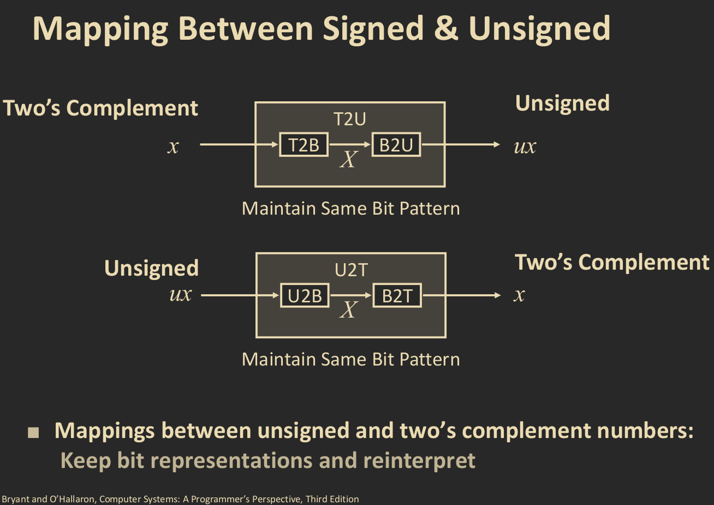
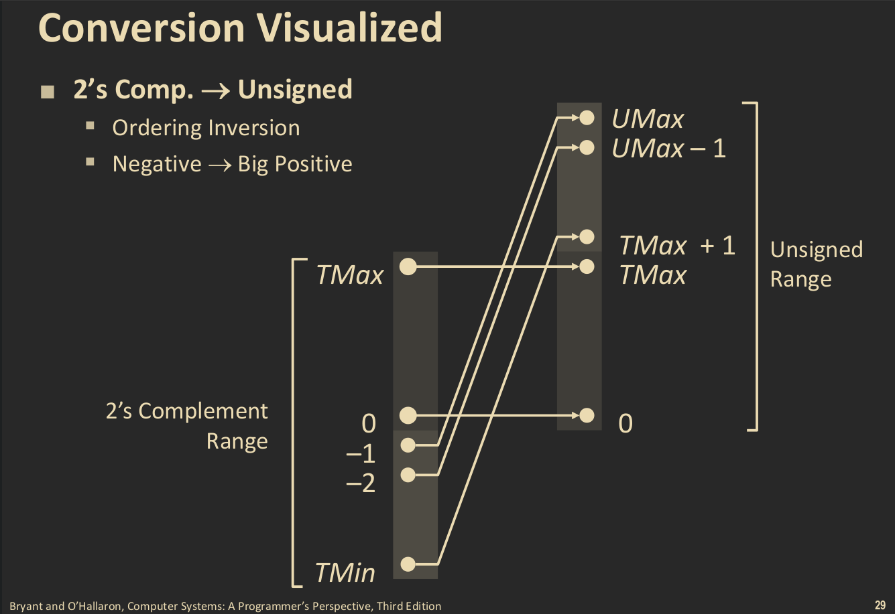
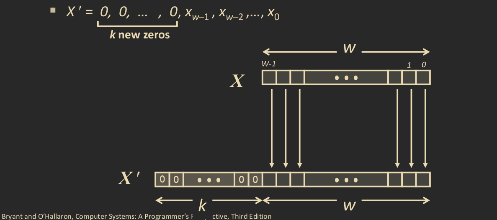
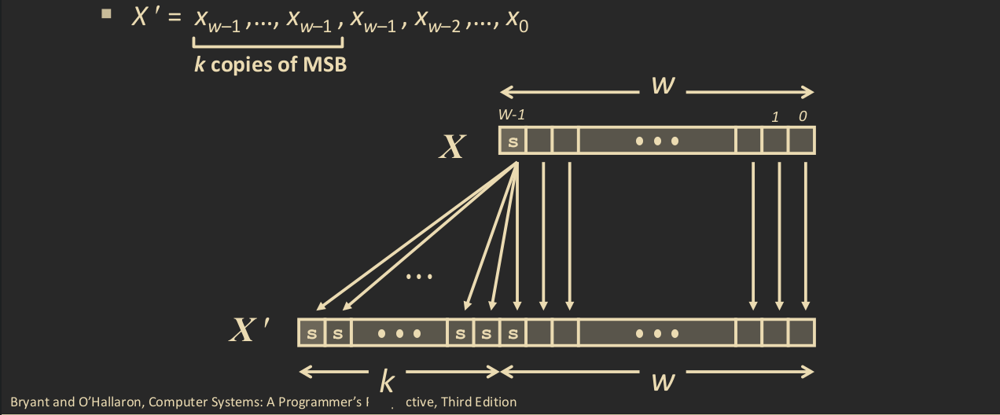
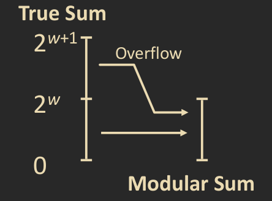
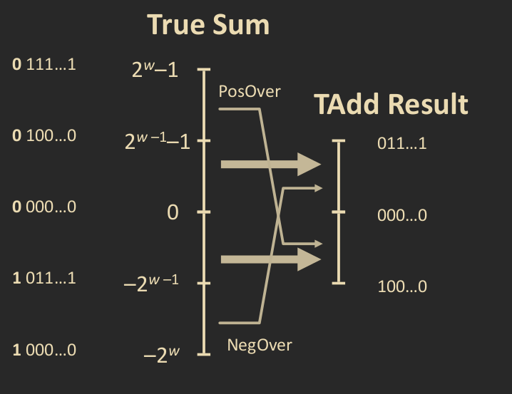

# Integers.

## Encoding of integers.

Machines represent integers in two ways. The first is **unsigned** (denoted
`unsigned` in `C`), in which the machine reads the bits as is and assigns 
them a nonnegative integer value. Machines can also represent **signed** integers 
(deonoted `signed` in `C`), in where the bits have been  encoded to account for 
negative values as well.

Below are the encoding schemes for encoding unsigned integers represented by the 
mapping $$B2U$$, and encoding signed integers using two's complement, represented 
by the mapping $$B2T$$.

$$
B2U: x  \rightarrow \sum_{i=1}^{w-1}{x_i2^i}
$$

$$
B2T: x  \rightarrow -x_{w-1}2^{w-1}+\sum_{i=1}^{w-2}{x_i2^i}
$$

In $$B2T$$, we call the most significant bit the **sign** bit, and represents a 
negative if it is `1` and a positive if it is `0`.

### Unsigned Integers.

Recall that machines encode these bits onto a finite range of values. For 
unsigned integers, the maximum possible unique value that can be represented is 
where the bit vector $$x$$ consists of all `1`s, in which case the we get

$$
B2U(x)=\sum{2^i}=2^{w}-1
$$

The minimum possible unique value for unsigned integers, is of course `0`. So we 
get for any given bit vector $$x$$:

$$
0 \leq B2U \leq 2^{w}-1
$$

We call the minumum and maximum values of unsigned integers $$UMIN$$ and
    $$UMAX$$ respectively.

### Signed Integers.

The ranges are different for signed integers encoded in two's complement. Since 
the most significant bit is the sign bit, we have the smallest possible value is 
given by the bit vector $$x=(0, ...,0, 1)$$, and the greatest possible value
is $$x=(1, ..., 1, 0)$$. In the case for the these two bit vectors, we get the 
minimum and maximum possible unique representation of $$x$$.

$$
B2T(1, \dots, 1, 0) = TMAX=\sum_{i=0}^{w-2}{2^i}=2^{w-1}-1 \\

B2T(0, \dots, 0, 1) = TMIN=-2^{w-1}
$$

So we see that

$$
-2^{w-1} \leq  B2T(x) \leq 2^{w-1}-1
$$

Is the range of all possible unique values for two's complement encoding. We 
should not that unlike the range for unsigned encoding, this range is not symmetric.

We can notice two things about our given ranges for these numbers. We first note 
that: 

$$
2^w = 2 \cdot (2^{w-1}-1)+1 \\
|-2^{w-1}| = (2^{w-1})+1
$$

So $$UMAX = 2TMAX+1$$ and $$|TMIN|=TMAX+1$$. The latter also indicates an 
asymmetric range for signed integers encoded with two's complement. It is 
important that integers encoded with these two schemes are only unique for 
their assigned ranges. It is also worth noting that the two mappings $$B2U$$ and $$B2T$$
are also bijective, that is there exist inverses

$$
U2B=B2U^{-1} \\
T2B = B2T^{-1} \\
$$

This allows us to do many things with integer encodings. This brings us to 
conversion of integers.

## Conversion and Casting

The property of the encoding schemes for unsigned and signed integers being 
bijective, and the existence of their inverses allows us great flexibility with 
bit representations of integers. In particular, we can convert unsigned integers 
to signed and back. Such a conversion does not preserve the value of the given 
integer, but it does preserve the bit ordering of the given integer. We convert 
a given integer $$x$$, with bit vector $$x=(x_0, \dots, x_w)$$ using the
mappings $$B2U$$ and $$B2T$$, and their inverses defines maps $$U2T$$ and $$T2U$$ 
by taking:

$$
U2T: x \rightarrow B2T(U2B(x)) \\
T2U: x \rightarrow B2U(T2B(x))
$$



These conversions just change the interpretation of the bit vector, which is good 
as we do not have to alter the bit vector itself, just its meaning. One 
consequence of the conversions, with signed to unsigned, is that large negative 
weights become large positive weights. The order is inverted as well. We can 
visualize this with the following figure.



## Signed vs. Unsinged numbers in C/C++

In `C/C++`, integer literals are assumed, by default to be signed. To declare an 
unsigned integers, simply append a `u` to the assignment; for example `int a = 30u`
declares `a` to be the integer `30` in unsigned.  You can also call integers to 
be unsigned or signed by casting them as such, for example `int sa = 
(signed int) a` takes `a` as a signed `int` and stores it in `int`.  
`C/C++` can also cast integers implicitly. For example, in the following code:

```c
int tx ,ty
unsigned int ux, uy;

tx = ux;
uy = ty;
```

Initializing `ux` to `tx` will \(implicitly\) cast `ux` as a `signed int`, while 
assinging `ty` to `uy` will cast `ty` as an `unsigned int`. While `C/C++` supports 
this kind of casting, this practice can lead to problems in readability of the 
code, which is essential for debugging.

When printing integers with `printf()`, using the directives `%d`,`%u`, and `%x` 
will display the given integers as a signed decimal, an usigned decimal, and in
hexidecimal respectively. However, it is also possible to print an `int` with 
`%u` and an `unsigned int` with `%d`. `C` does not use any type information with 
these directives.

The use of signed and unsigned numbers in `C/C++` isn't just only in interpretation, 
and in displaying, it also can be used with evaluation and comparisons. 
Specifically, if there is a mix of signed and unsigned integers in a given 
expression, the signed integers will be implicitly cast as unsigned integers; 
so great care should be taken when evaluating signed and unsigned integers. 
These evaluations extend to comparisons, and can produce some unintuitive 
results, however these can be explained as signed integers have different 
values when converted to unsigned and vice versa.


|   Constant 1  |   Relation    |   Constant 2              |   Evaluation         |
|:---           |   :---:       |   :---:                   |                  ---:| 
|`0`            |   `==`        |   `0u`                    |   `unsigned`         | 
|`-1`           |   `<`         |   `0`                     |     `signed`         |
|`-1`           |   `>`         |   `0u`                    |   `unsigned`         |
|`2147483647`   |   `>`         |   `-2147483647-1`         |     `signed`         |
|`2147483647u`  |   `<`         |   `-2147483647-1`         |   `unsigned`         |
|`-1`           |   `>`         |   `-2`                    |     `signed`         |
|`-1u`          |   `>`         |   `-2`                    |   `unsigned`         |
|`2147483647`   |   `>`         |   `2147483647u`           |   `unsigned`         |
|`2147483647`   |   `<`         |   `(int) 2147483647u`     |   `signed`(overflow) |

## Expanding and Truncating.

We can also expand and truncate integers.

### Zero Expansion and Sign Extension.



Given a $$w$$ bit bit vector $$x$$, we expand $$x$$ by $$k$$ bits by appending $$k$$ 
`0`s to the most significant positions. That is if 

$$
x=(x_0, \dots x_w)
$$

Then zero expansion gives a bit vector

$$
x'=(x_0, \dots, x_w, \dots, x_{w+k}) \text{ where } x_i=0 \text{ for } w < i \leq w+k
$$

This kind of expansion works best for `unsigned int`s and expands the bit vector 
to be a $$w+k$$ bit integer, without changing the value.

We can also perform a sign extension when dealing with `signed int`s, in where 
we append the sign bit $$k$$ times to the most significant bit. The procedure is 
the same as above, exepct instead of zeros, we append the sign bit \(the most 
significant bit\), which is either `1` or `0`.



These kinds of operations are useful when we need to go from a smaller data 
type, say, a `32` bit `int`, to a larger data type, such as a `64` bit `int`.

### Truncation.

Given a bit vector $$x=(x_0, \dots, x_w)$$ We can **truncate** it by dropping the 
most significant `w-k` bits in the vector. More formally, given the a bit vector $$x$$ 
\( as descibed above\). Truncating $$x$$ to $$k$$ bits gives a bit vector of 
length $$w-k$$ of the form: $$x'=(x_0, \dots, x_{k-1})$$

If we let $$y = B2U(x)$$ and $$y' = B2U(x')$$, then we get 

$$
x' \equiv x \mod{2^k}
$$

If $$y = B2T(x)$$ and $$y' = B2T(x')$$, then

$$
x' = U2T(x \mod{2})
$$

This method works for both signed and unsigned values; however, unlike expansion,
truncating changes the value of the integer. That makes sense, as we are dropping
information from the bit vector. For `unsigned int`s, the result is equivalent 
to taking the integer mod $$2^k$$. For `signed ints`s, it is similar.

## Arithmetic.

Given that there are ranges for signed and unsigned integers, operations such as 
addition and multiplication, and shifting can produce unexepected values. For 
example, we may add two $$w$$ bit integers and get a $$w+1$$ bit integer \(try adding 
`1111` to itself\), this produces something called **overflow**, in where the value 
wraps around the range. This gives the arithmetic upon these kinds of numbers a 
modular nature.

Similarly, the multiplication of $$2$$ $$w$$ bit numbers can result in a $$2w$$ 
bit number \(multipy the previous example by itself\). This goes for both signed 
and unsigned integers.

### Shift operations.

For shift operations, a left shift will just give you the same integer 
multiplied by $$2^k$$, that is:

$$
x << k = x \cdot 2^k
$$

This goes for both signed and unsigned values.

A logical shift divides by $$2^k$$ and returns the floor. If the integer is 
unsigned, a logical right shift is used, where as an arithmetic right shift is 
used for signed values.

$$
x >> k = \lfloor \frac{u}{2^k} \rfloor
$$

For signed values, and since the floor always rounds down, if $$x<0$$, we can get 
a wrong value, in this case, it would be good to get the cieling, in this case we 
just compute

$$
\lfloor \frac{x+2^k-1}{2^k}\rfloor
$$

Or, as `C` evaluates it: `(x+(1 << k)-1) >> k`.

### Unsigned arithmetic.

For unsigned addition, we simply ignore carry bits; that is, any bits that cause 
the number to overflow\), and  implement modular addition. Similarly, 
multiplication is treated in the same way, with the modular product instead.



For unsinged integers, there is really only one way for the value to overflow. 
This cannot be said for unsigned integers.

### Signed arithmetic.

For signed integer values, the range goes from a negative value to a postive value, 
hence there are two ways for addition and multiplication to overflow, the first is 
where it overflows towards the upperbound, which results in a wrap around to a 
negative number, we call this **positive overflow** \(since it overflows in the 
positive direction\). The other way for the value to over flow is towards the 
lower bound, in where the wrap around will occur at a positive number; this is 
called **negative overflow**. In either case, the arithmetic should be accounted 
for these two possible overflows.


For signed multiplication, there are somethings to note. Particularly, the 
multiplication will ignore the higher order $$w$$ bits, moreover, it seems to 
leave the least significant bits the same as well.



One thing should be noted about the multiplication of integers in computers. 
If we were to express exact values with multiplication, we would need to keep 
expanding the word size significantly after each computation. This is done in 
some applications, particularly in mathematics programs where the precision is 
necessary; however, in practice, it is inefficient, as more word sizes get exhausted 
and slows down computation. What is most often done is that the bits are truncated. 
Even then, multiplication can be slow. In fact, since multipication can be so slow, 
it would be better to generate the same values using shifts and adds, which can 
be performed quickly on machines.
