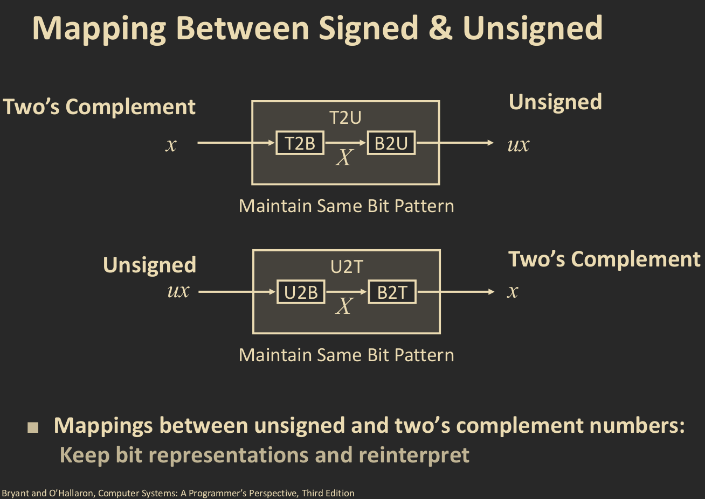
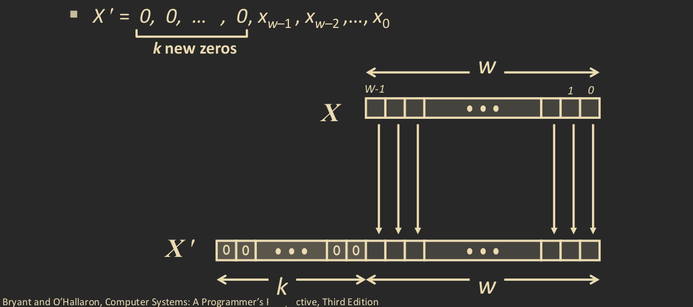
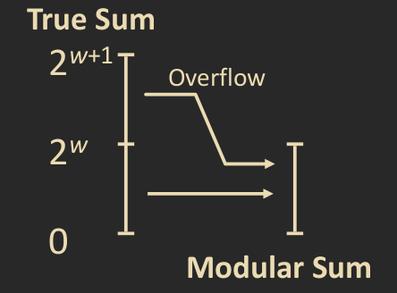
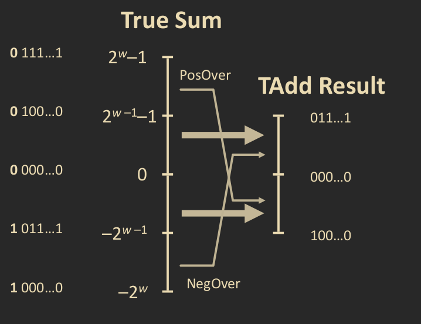

# Integers.

## Encoding of integers.

Machines represent integers in two ways. The first is **unsigned** \(denoted
`unsigned` in `C`\), in which the machine reads the bits as is and assigns them
a nonnegative integer value. Machines can also represent **signed** integers
\(deonoted `signed` in `C`\), in where the bits have been encoded to account for
negative values as well.

Below are the encoding schemes for encoding unsigned integers represented by
the mapping $$B2U$$, and encoding signed integers using two's complement,
represented by the mapping $$B2T$$.

$$
B2U: x  \rightarrow \sum_{i=1}^{w-1}{x_i2^i}
$$

$$
B2T: x  \rightarrow -x_{w-1}2^{w-1}+\sum_{i=1}^{w-2}{x_i2^i}
$$

In $$B2T$$, we call the most significant bit the **sign** bit, and represents
a negative if it is `1` and a positive if it is `0`.

### Unsigned Integers.

Recall that machines encode these bits onto a finite range of values. For
unsigned integers, the maximum possible unique value that can be represented is
where the bit vector $$x$$ consists of all `1`s, in which case the we get

$$
B2U(x)=\sum{2^i}=2^{w}-1
$$

The minimum possible unique value for unsigned integers, is of course `0`. So
we get for any given bit vector $$x$$:

$$
0 \leq B2U \leq 2^{w}-1
$$

We call the minumum and maximum values of unsigned integers $$UMIN$$ and
$$UMAX$$ respectively.

### Signed Integers.

The ranges are different for signed integers encoded in two's complement. Since
the most significant bit is the sign bit, we have the smallest possible value is
given by the bit vector $$x=(0, ...,0, 1)$$, and the greatest possible value is
$$x=(1, ..., 1, 0)$$. In the case for the these two bit vectors, we get the
minimum and maximum possible unique representation of $$x$$.

$$
B2T(1, \dots, 1, 0) = TMAX=\sum_{i=0}^{w-2}{2^i}=2^{w-1}-1 \\

B2T(0, \dots, 0, 1) = TMIN=-2^{w-1}
$$

So we see that

$$
-2^{w-1} \leq  B2T(x) \leq 2^{w-1}-1
$$

Is the range of all possible unique values for two's complement encoding. We
should not that unlike the range for unsigned encoding, this range is not
symmetric.

We can notice two things about our given ranges for these numbers. We first
note that:

$$
2^w = 2 \cdot (2^{w-1}-1)+1 \\
|-2^{w-1}| = (2^{w-1})+1
$$

So $$UMAX = 2TMAX+1$$ and $$|TMIN|=TMAX+1$$. The latter also indicates an
asymmetric range for signed integers encoded with two's complement. It is
important that integers encoded with these two schemes are only unique for their
assigned ranges. It is also worth noting that the two mappings $$B2U$$ and
$$B2T$$ are also bijective, that is there exist inverses

$$
U2B=B2U^{-1} \\
T2B = B2T^{-1} \\
$$

This allows us to do many things with integer encodings. This brings us to
conversion of integers.

## Conversion and Casting

The property of the encoding schemes for unsigned and signed integers being
bijective, and the existence of their inverses allows us great flexibility with
bit representations of integers. In particular, we can convert unsigned integers
to signed and back. Such a conversion does not preserve the value of the given
integer, but it does preserve the bit ordering of the given integer. We convert
a given integer $$x$$, with bit vector $$x=(x_0, \dots, x_w)$$ using the
mappings $$B2U$$ and $$B2T$$, and their inverses defines maps $$U2T$$ and
$$T2U$$ by taking:

$$
U2T: x \rightarrow B2T(U2B(x)) \\
T2U: x \rightarrow B2U(T2B(x))
$$



These conversions just change the interpretation of the bit vector, which is
good as we do not have to alter the bit vector itself, just its meaning. One
consequence of the conversions, with signed to unsigned, is that large negative
weights become large positive weights. The order is inverted as well. We can
visualize this with the following figure.


## Signed vs. Unsinged numbers in C/C++

In `C/C++`, integer literals are assumed, by default to be signed. To declare
an unsigned integers, simply append a `u` to the assignment; for example `int
a = 30u` declares `a` to be the integer `30` in unsigned. You can also call
integers to be unsigned or signed by casting them as such, for example `int sa
= (signed int) a` takes `a` as a signed `int` and stores it in `int`.  `C/C++`
can also cast integers implicitly. For example, in the following code:

```c
int tx ,ty
unsigned int ux, uy;

tx = ux;
uy = ty;
```

Initializing `ux` to `tx` will \(implicitly\) cast `ux` as a `signed int`,
while assinging `ty` to `uy` will cast `ty` as an `unsigned int`. While `C/C++`
supports this kind of casting, this practice can lead to problems in readability
of the code, which is essential for debugging.

When printing integers with `printf()`, using the directives `%d`,`%u`, and
`%x` will display the given integers as a signed decimal, an usigned decimal,
and in hexidecimal respectively. However, it is also possible to print an `int`
with `%u` and an `unsigned int` with `%d`. `C` does not use any type information
with these directives.

The use of signed and unsigned numbers in `C/C++` isn't just only in
interpretation, and in displaying, it also can be used with evaluation and
comparisons. Specifically, if there is a mix of signed and unsigned integers in
a given expression, the signed integers will be implicitly cast as unsigned
integers; so great care should be taken when evaluating signed and unsigned
integers. These evaluations extend to comparisons, and can produce some
unintuitive results, however these can be explained as signed integers have
different values when converted to unsigned and vice versa.

| Constant 1 | Relation | Constant 2 | Evaluation |
| :--- | :---: | :---: | ---: |
| `0` | `==` | `0u` | `unsigned` |
| `-1` | `<` | `0` | `signed` |
| `-1` | `>` | `0u` | `unsigned` |
| `2147483647` | `>` | `-2147483647-1` | `signed` |
| `2147483647u` | `<` | `-2147483647-1` | `unsigned` |
| `-1` | `>` | `-2` | `signed` |
| `-1u` | `>` | `-2` | `unsigned` |
| `2147483647` | `>` | `2147483647u` | `unsigned` |
| `2147483647` | `<` | `(int) 2147483647u` | `signed`\(overflow\) |

## Expanding and Truncating.

We can also expand and truncate integers.

### Zero Expansion and Sign Extension.



Given a $$w$$ bit bit vector $$x$$, we expand $$x$$ by $$k$$ bits by appending
$$k$$ `0`s to the most significant positions. That is if

$$
x=(x_0, \dots x_w)
$$

Then zero expansion gives a bit vector

$$
x'=(x_0, \dots, x_w, \dots, x_{w+k}) \text{ where } x_i=0 \text{ for } w < i 
\leq w+k
$$

This kind of expansion works best for `unsigned int`s and expands the bit
vector to be a $$w+k$$ bit integer, without changing the value.

We can also perform a sign extension when dealing with `signed int`s, in where
we append the sign bit $$k$$ times to the most significant bit. The procedure is
the same as above, exepct instead of zeros, we append the sign bit \(the most
significant bit\), which is either `1` or `0`.


These kinds of operations are useful when we need to go from a smaller data
type, say, a `32` bit `int`, to a larger data type, such as a `64` bit `int`.

### Truncation.

Given a bit vector $$x=(x_0, \dots, x_w)$$ We can **truncate** it by dropping
the most significant `w-k` bits in the vector. More formally, given the a bit
vector $$x$$ \( as descibed above\). Truncating $$x$$ to $$k$$ bits gives a bit
vector of length $$w-k$$ of the form: $$x'=(x_0, \dots, x_{k-1})$$

If we let $$y = B2U(x)$$ and $$y' = B2U(x')$$, then we get

$$
x' \equiv x \mod{2^k}
$$

If $$y = B2T(x)$$ and $$y' = B2T(x')$$, then

$$
x' = U2T(x \mod{2})
$$

This method works for both signed and unsigned values; however, unlike
expansion, truncating changes the value of the integer. That makes sense, as we
are dropping information from the bit vector. For `unsigned int`s, the result is
equivalent to taking the integer mod $$2^k$$. For `signed ints`s, it is similar.

## Arithmetic.

Given that there are ranges for signed and unsigned integers, operations such
as addition and multiplication, and shifting can produce unexepected values. For
example, we may add two $$w$$ bit integers and get a $$w+1$$ bit integer \(try
adding `1111` to itself\), this produces something called **overflow**, in where
the value wraps around the range. This gives the arithmetic upon these kinds of
numbers a modular nature.

S imilarly, the multiplication of $$2$$ $$w$$ bit numbers can result in a $$2w$$
bit number \(multipy the previous example by itself\). This goes for both signed
and unsigned integers.

### Shift operations.

For shift operations, a left shift will just give you the same integer
multiplied by $$2^k$$, that is:

$$
x << k = x \cdot 2^k
$$

This goes for both signed and unsigned values.

A logical shift divides by $$2^k$$ and returns the floor. If the integer is
unsigned, a logical right shift is used, where as an arithmetic right shift is
used for signed values.

$$
x >> k = \lfloor \frac{u}{2^k} \rfloor
$$

For signed values, and since the floor always rounds down, if $$x<0$$, we can
get a wrong value, in this case, it would be good to get the cieling, in this
case we just compute

$$
\lfloor \frac{x+2^k-1}{2^k}\rfloor
$$

Or, as `C` evaluates it: `(x+(1 << k)-1) >> k`.

### Unsigned arithmetic.

For unsigned addition, we simply ignore carry bits; that is, any bits that
cause the number to overflow\), and implement modular addition. Similarly,
multiplication is treated in the same way, with the modular product instead.



For unsinged integers, there is really only one way for the value to overflow.
This cannot be said for unsigned integers.

### Signed arithmetic.

For signed integer values, the range goes from a negative value to a postive
value, hence there are two ways for addition and multiplication to overflow, the
first is where it overflows towards the upperbound, which results in a wrap
around to a negative number, we call this **positive overflow** \(since it
overflows in the positive direction\). The other way for the value to over flow
is towards the lower bound, in where the wrap around will occur at a positive
number; this is called **negative overflow**. In either case, the arithmetic
should be accounted for these two possible overflows.

For signed multiplication, there are somethings to note. Particularly, the
multiplication will ignore the higher order $$w$$ bits, moreover, it seems to
leave the least significant bits the same as well.



One thing should be noted about the multiplication of integers in computers. If
we were to express exact values with multiplication, we would need to keep
expanding the word size significantly after each computation. This is done in
some applications, particularly in mathematics programs where the precision is
necessary; however, in practice, it is inefficient, as more word sizes get
exhausted and slows down computation. What is most often done is that the bits
are truncated. Even then, multiplication can be slow. In fact, since
multipication can be so slow, it would be better to generate the same values
using shifts and adds, which can be performed quickly on machines.
