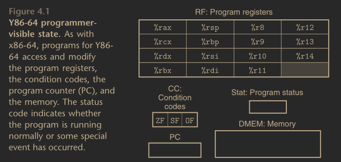
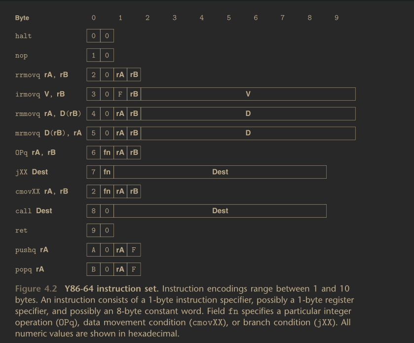
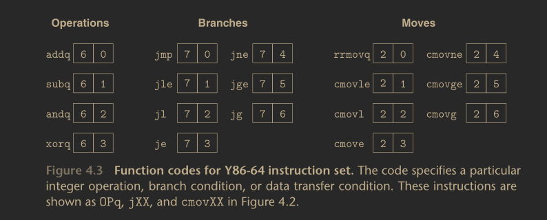

To define the `Y86_64` ISA, we must define the different components of its
state, its set of instructions, and thier encodings. Additionally, we must also
define a set of programming conventions, and the handling of certain
exceptional events. We go over all of these in this section.

## Programmer Visible States.

The instructions in a `Y86_64` progra can read and modify part of the procesor
state. We call this the **programmer visible** state; here the programmer can
be someone writing the assembly code, or the compiler generating the machine
code. If we can make the machine level program appear to have access to the
programmer visible state, then we do not have to worry anout organizing the
state in the specification implied by the `Y86_64` ISA.

Similar to `x86_64`, `Y86_64` has 15 program registers, labeled `rax`, `rbx`,
`rcx`, `rdx`, `rsp`, `rbp`, `rdi`, `rsi`, and `r8`-`r14`. Each of these
registers store a `64` bit word; `rsp` is the stack pointer used by the relavent
`push` and `pop` instructions, and the other registers have no fixed meaning.
There are also three single bit condition codes `ZF`, `OF`, and `SF` used for
the zero bit, the overflow bit, and the sign bit, respectively. The program
counter holds the address of the instruction being executed.

Memory is viewed in the `Y86_64` ISA as a large array of bytes holding both
program and data. Programs in this ISA reference memory locations using virtual
addresses, which the operating system and the hardware then translates into the
actual physical addresses in moemry. Finally, the last part of the programs
state is the status code, `Stat` whcih indicates the state of the program
execution. It indicates either the normal operation, or whether an exception
has occurred, for example, when an instruction tries to read an illegal area in
memory. It returns the appropriate status code.

## Instructions.

We can consider the set of `Y86_64` instructions as a subset of the `x86_64`
instructions set. It includes only `8` byte integer operations, and has fewer
addressing modes, as well as including a smaller set of operations. We refer to
these `8` byte data as words. The assembly code format is also similar to the
`AT&T` format for `x86_64`.

The `movq` instruction from `x86_64` is split into four different instructions:
-   `irmovq`.
    - Immediate to register.
    - `irmovq V, rB`
-   `rrmovq`.
    - Register to register.
    - `rrmovq rA, rB`
-   `mrmovq`.
    - Memory to register.
    - `mrmovq D(rB), rA`
-   `rmmovq`.
    - Register to memory.
    - `rmmovq rA, D(rB)`

The prefix indicates the source, then destination. For example, the `ir` in
`irmovq` indicates that the source is an immediate, and the destination is a
register; so the `irmovq` instruction is used to store an immediate into a
register. Similarly, the `mrmovq` stores a memory address into a register. So
it is useful to keep in mind with these instructions that the first prefix
denotes the source, and the second prefix denotes the destination.
Memory referencing for two memory movement instructions have a simple base and
discplacement format. Hence supporting the second index register or any scaling
of the register's value in the address computation is not supported.

There are four integer operation instructions, which we can denote as `OPq`:
-   `addq`
    - Add two operands. Store in the destination.
-   `subq`
    - Subtract two operands. Store in the destination.
-   `andq`
    - Perfom the `and` of two operands. Store in the destination.
-   `xorq`
    - Perform the `xor` of two operands. Store in the destination.

Unlike the `x86_64` counterpart whicha llows for opperating on memory, these
only operate on register data. These operations also set the condition codes
`ZF`, `OF`, and `SF`. The usage for these instructions are: `OPq rA, rB`.

There are seven `jmp` instructions, which have the form `jXX`, with the usage
`jXX Dest`. The `jXX` instructions are as follows:
-   `jmp`
    - Unconditional jump.
-   `jle`
    - Jump if less than or equal.
-   `jl`
    - Jump if strictly less than.
-   `je`
    - Jump if equal.
-   `jne`
    - Jump if not equal.
-   `jge`
    - Jump if greater than or equal.
-   `jg`
    - Jump if strictly greater than.

The branches are taken according to the type of branch and the setting of the
condition codes. These conditions are the same as in `x86`. There are also six
conditional `mov` instructions; which have the same format as the register to
register move instruction `rrmovq`, with the exception that the desitination is
updated only if the condition code satisfies the constraints. Thes conditional
`mov` instructions are:
-   `cmovle`
    - Move if less than or equal.
-   `cmovl`
    - Move if strictly less than.
-   `cmove`
    - Move if equal.
-   `cmovene`
    - Move if not equal.
-   `cmovge`
    - Move if greater than or equal.
-   `cmovg`
    - Move if strictly greater than.

The `cmov` instructions have the usage `cmovXX rA, rB`.

The `call` instruction pushes the return address onto the stack, and then jumps
to the destination, while the `ret` instruction returns from the call. The
`pushq` and `popq` instructions push and pop values onto and off of the stack,
respectively. Finally, the `halt` instruction stops the instruction execution.
The analogous instruction in `x86_64` is the `hlt` instruction; however the
`x86_64` application programs are not permitted to use this instruction, as it
can cause the entire system to suspend operation. For `Y86_64`, all the `halt`
instruction does is stop the processor and set the status code to `HLT`. The
`call`, `pushq`, and `popq` have the following usage:
-   `call Dest`.
-   `pushq rA`.
-   `popq rA`.

where as the `ret`, and `halt` instructions take no arguments.

## Instruction Encoding.

Shown above are the byte lebel encoding for each of the instructions mentioned
above. Each instruction requires between `1` and `10` bytes, depending on the
required field. The instructions also has an initial byte specifying the
instruction type, and these bytes are sp;lit into a a `4` bit **high order**,
or **code** and a `4` bit **low order**, or **function**. The function values
are significant only when a group of related instructions share a common code.
For example, `rrmovq` has the same instruction code as the condition move.

Shown below is a list of the `15` program registers. Each of these registers
has an associated **register identifier** ranging from `0x0`-`0xe`. These
registers are stored in the CPU within a **register file**, where the
identifiers serve as addresses. The ID `0xf` simply serves to indicate that no
register should be accessed.

|Number     |   Register    |   Number      |       Register|
|:---       |   :---:       |   :---:       |           ---:|
|$$0$$      |   `rax`       |    `8`        |       `r8`    |
|$$1$$      |   `rcx`       |    `9`        |       `r9`    |
|$$2$$      |   `rdx`       |    `a`        |       `r10`   |
|$$3$$      |   `rbx`       |    `b`        |       `r11`   |
|$$4$$      |   `rsp`       |    `c`        |       `r12`   |
|$$5$$      |   `rbp`       |    `d`        |       `r13`   |
|$$6$$      |   `rsi`       |    `e`        |       `r14`   |
|$$7$$      |   `rdi`       |    `f`        |       None    |

There can be an additional **register specific byte**, specifying either one,
or two registers which we call `rA` and `rB`. They can specify the register
used for data soruces and destinations, as well as the base register used in an
address computation. Instructions with no register operands, such as `call` do
not have a register specifier byte. Those requiring only one register operand
have the other register specifier byt set to `0xf`.

Some instructions require an `8` byte constant word. This word can serve as the
immediate data type for `irmovq`, the displacement for `rmmovq`, `mrmovq`, as
well as the destination of branches and calls. The branch and call destinations
are given as absolute addresses and are not PC relative. PC relative addressing
give more compact encoding and allows code to be shifted to one part of memory
to another without needing to update all of the branch target addresses; these
are not necessary in `Y86_64`, as the purpose for this ISA is just to
illustrate how ISAs work. Additionally, `Y86_64` also uses the little endian
convention just like the `x86` ISAs.

AN important property of any instruction set architecture is that the byte
encodings *mus* have a unique interpretation. An arbitrary sequence of bytes
either encodes a unique instruction sequence, or is an illegal byte sequence.
This property ensures that a processor can execute an object code program
without any ambiguity. Additionally, if we embedd the code withi other bytes of
the program, as long as we know the starting address, we can determine the
instruction sequence. If we do not know this starting address, then we cannot
reliably determine where to split the sequence into the individual
instructions. This presents a problem for disassemblers and other tools that
try to extract the machine level code directly from object code byte sequences;
hence it presents a prpblem for anyone trying to reverse engineer a particular
program.

## `Y86_64` Exceptions.

|Value      |       Name        |                       Meaning |
|:---       |   :---:           |                          ---: |
|`1`        |   `AOK`           |   Normal Operation.           |
|`2`        |   `HLT`           |   `halt` encountered.         |
|`3`        |   `ADR`           |   Invalid address.            |
|`4`        |   `INS`           |   Invalid instruction.        |
